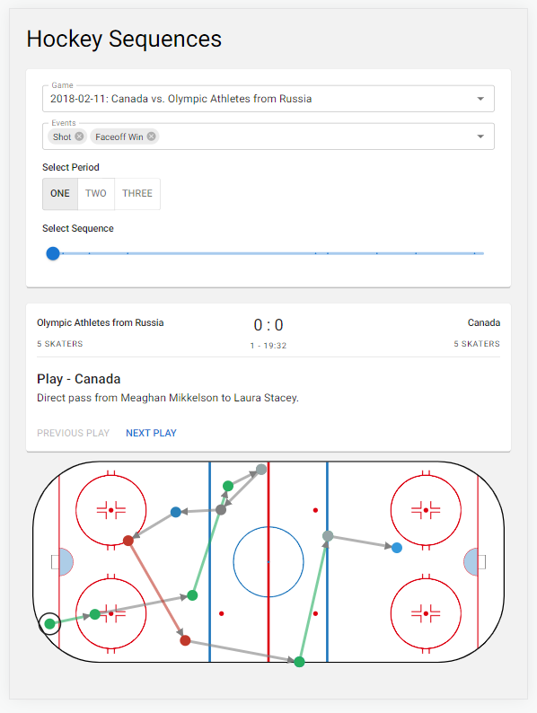

# Hockey Sequences

## Website
https://hockey-sequences.netlify.app/

## Design ideas and assumptions
One of the areas I've always wanted to explore was linking individual events into sequences, to gather more contextual information about specific events (ex. what past events lead to a shot on net?). With the Women's Olympic hockey dataset provided, I wanted to provide a simple and easy-to-use interface that would allow coaches or analysts to walk through these sequences without need to walk through raw data. For the design, some of my ideas and assumptions were:

- The intended user may not be at their desk, so the interface must be available on-demand, and must be mobile-responsive.
- The interface must be simple to use, and only serve a single purpose (i.e. to provide contextual information around hockey events).
- The interface might be used during time-sensitive moments, so it must be performant and quick to display data.
- The sequence data may be used independent of the interface (by analysts), and should be accessible outside of the UI interface.

## Implementation
### Front-end
- The front-end (this repository) was built using React, using [Material UI](https://mui.com/) components to expedite development and provide a modern and responsive interface
- Instead of using pre-built graphing libraries like plotly, I decided to build a custom ice rink chart using [visx](https://airbnb.io/visx/) components. This allowed me to create re-usable components for other charts, and would allow me to easily modify the charts based on user feedback.
- I deployed the front-end using Netlify.

### Back-end
- I built the back-end using Python and Flask to prop up a simple API for the front-end. This allowed me to split the dataset into smaller network calls, to ensure the front-end remained performant.
- I leveraged pandas to translate the raw data into hockey sequences, and persisted the data into a sqlite database. 
- I deployed the back-end through a docker container to Heroku: https://hockey-sequences.herokuapp.com/sequences
- The code for the back-end can be found in the following repository: https://github.com/danpanaite/hockey-sequences-backend

## Areas of Improvement
- The generation of sequence data is super slow! Creating the data is a one-time initialization step, but it would definitely be painful to generate the data for a full hockey season. I would like to take more time and explore approaches to leveraging vectorization techniques to improve the performance.
- While I think the visualization provides a good start for providing contextual information, it isn't terribly actionable. I'd be curious to know what information coaches or analysts are looking for when looking at play-by-play events.
- Building both a front-end and back-end was an expensive task, so I wasn't able to fully focus on the best code practices. For the front-end, I would like to split my React components into more reusable components, and leverage a state management system. For the back-end, I would like to remove my data logic into a separate module outside of the API work, so that it could be used by other projects.